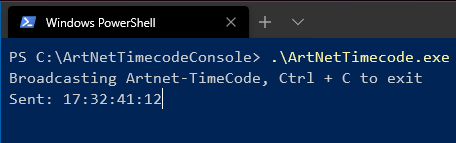

# ArtNetTimecodeConsole v1.0

 A simple .NET Core Console Application to send Art-Net Timecode

 ## Syntax
 ArtNetTimecode [ip]

 **ip** - (optional) if included ArtNetTimecode is unicast to the IP address, else ArtNetTimecode will be broadcast (255.255.255.255)

 In this version the local computers Time of day will be used for the ArtNetTimecode.

